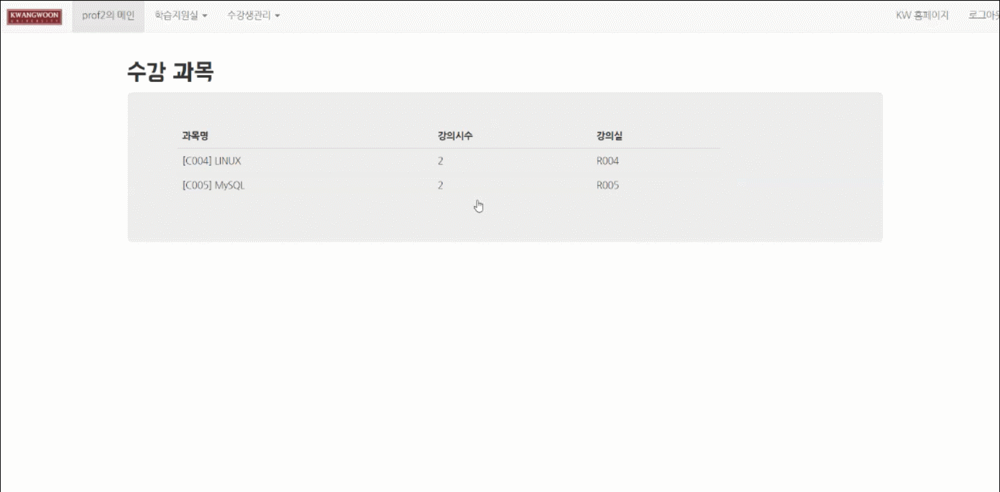
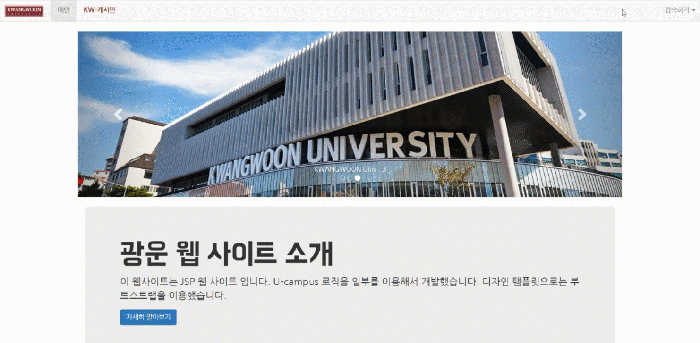

# 광운 모의 대학 종합 정보시스템 
대학교 종합 서비스 시스템에서 가장 기본적인 기능인 학생/교수의 강의 지원 시스템 구현을 통해 각종 자료 열람 및 등록, 수강인원 알림 메일 발송의 기능을 JSP로 구현하였다.

* 첫 배너 화면
 </img>

* 교수가 강의 자료 등록
 

* 학생이 강의 자료 다운

* 교수가 안내 메일 발송, 학생이 안내 메일 확인

