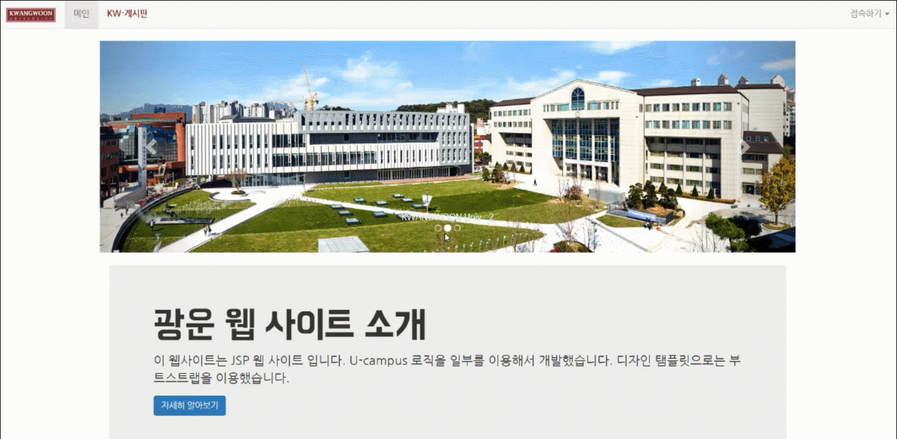

# 모의 대학 종합 정보시스템 
대학교 종합 서비스 시스템에서 가장 기본적인 기능인 학생/교수의 강의 지원 시스템 구현을 통해 각종 자료 열람 및 등록, 수강인원 알림 메일 발송의 기능을 JSP로 구현하였다.

ScreenShot
----------------

     
    

  
   
  

 &emsp;* 학생이 강의 자료 다운&emsp;&emsp;&emsp;&emsp;&emsp;&emsp;&emsp;&emsp;&emsp;&emsp;&emsp;&emsp;&emsp;&emsp;&emsp;&emsp;&emsp;* 교수가 안내 메일 발송, 학생이 안내 메일 
 

| 값 | 의미 | 기본값 |
|:---:|:---:|---:|
| `static` | 유형(기준) 없음 / 배치 불가능 | `static` |
| `relative` | 요소 자신을 기준으로 배치 |  |
| `absolute` | 위치 상 부모(조상)요소를 기준으로 배치 |  |
| `fixed` | 브라우저 창을 기준으로 배치 |  |
